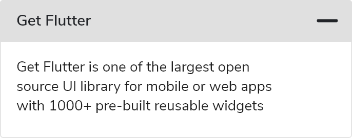
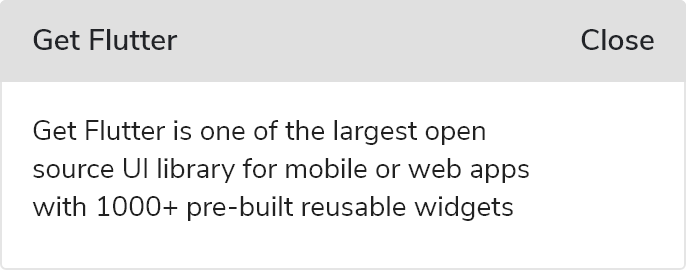

# GF Accordion


### Usage

The simple code of a basic Accordion is as shown below

```dart
 import 'package:getflutter/getflutter.dart';
 
 GFAccordian(
    title: 'GF Accordion',
    content: Text('GetFlutter is an open source library that comes with pre-build 1000+ UI components.'
    )
)
```

### Accordion with Icon



Icons are mostly used in Accordion to show whether  the content is expanded or collapsed. The most commonly used icons are the up and down arrow icons. But we can use different icons to represent the hide and show event by using **collapsedIcon** and **expandedIcon**. The below code shows the usage:

```dart
import 'package:getflutter/getflutter.dart';

GFAccordian(
    title: 'GF Accordion',
    content: Text('GetFlutter is an open source library that comes with pre-build 1000+ UI components.'),
    collapsedIcon: Icon(Icons.add),
    expandedIcon: Icon(Icons.minimize)
),
```

### Accordion with trailing Text



The trailing part takes any widget like text, icon etc. The below code shows the accordion with the text.

```dart
import 'package:getflutter/getflutter.dart';
 
 GFAccordian(
     title: 'GF Accordion',
     content: Text('GetFlutter is an open source library that comes with pre-build 1000+ UI components.'),
     collapsedIcon: Text('Show'),
     expandedIcon: Text('Hide')
),
```

### Custom Properties

|  |  |
| :--- | :--- |
| **child** | **child** of type \[Widget\] which is alternative to **title**. **title** will get priority over **child** |
| **content** | shows its **children** when it is expanded |
| **contentChild** | **contentChild** of type \[Widget\] which is alternative to **content**. **content** will get priority over **contentChild** |
| **titlebackgroundColor** | changes the **backgroundColor** of the **Accordion** title |
| **collapsedIcon** | type of \[Widget\] when the **Accordion** is collpased |
| **expandedIcon** | type of \[Widget\] when the **Accordion** is expanded |
| **textStyle** | textStyle of type \[textStyle\] applicable to **title** only and not for **child** |
| **titlePadding** | padding used to set for the **Accordion** title |
| **contentPadding** | padding used to set for the **Accordion** description |
| **contentbackgroundColor** | changes the **backgroundColor** of the **Accordion** description |
| **margin** | used to set the margin of the **Accordion** |
| **titleborderColor** | used to change the color of the title **border** |
| **contentborderColor** | used to change the color of the content **border** |

