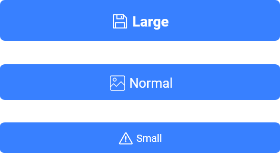

# Botón con ícono


## Botón con ícono

El atributo **shape** está definido por defecto como `GFButtonShape.standard`, por lo tanto, obtendremos un botón estándar con un sólido color de fondo y bordes ligeramente redondeados.

### Botón deshabilitado


El atributo **onPressed** de un GFIconButton es null por defecto, de esta forma obtenemos un botón deshabilitado.

```dart
import 'package:getflutter/getflutter.dart';

GFIconButton(                          
    onPressed: null,             
    text:"primary"
),
```

Se pueden utilizar muchos atributos para darle estilo a los botones GFIconButton y que luzcan de una manera específica. Cada uno de los atributos se describe a continuación.

### Botón sólido con ícono


El atributo **type** está definido por defecto como `GFButtonType.solid`, por lo tanto, obtendremos un botón con un sólido color de fondo y bordes ligeramente redondeados.

El callback disparado cuando se presiona el botón, definido en el atributo **onPressed**, habilita el botón.

```dart
import 'package:getflutter/getflutter.dart';

  GFButton(
    onPressed: (){},
    text: "primary",
    icon: Icon(Icons.share),
  ),
```

### Botón Outline con ícono


Outline Icon Button es un botón con fondo transparente y borde visible. Podemos obtener este botón facilmente definiedo el atributo **type** como **`GFButtonType.outline`**.

```dart
import 'package:getflutter/getflutter.dart';

GFButton(
    onPressed: (){},
    text: "primary",
    icon: Icon(Icons.share),
    type: GFButtonType.outline,
 ),
```

### Botón Outline 2x con ícono


Outline 2x Icon Button es un botón con fondo transparente y borde visible con un ancho de 2x. Podemos obtener este botón facilmente definiedo el atributo **type** como **`GFButtonType.outline2x`**.

```dart
import 'package:getflutter/getflutter.dart';

GFButton(
    onPressed: (){},
    text: "primary",
    icon: Icon(Icons.share),
    type: GFButtonType.outline2x,
 ),
```

### Botón transparente con ícono


En un GFIconButton, definiendo la propiedad **type** como **`GFButtonType.transparent`** obtenemos un botón transparente. Por defecto, el valor de **type** es **`GFButtonType.solid`**.

```dart
import 'package:getflutter/getflutter.dart';

GFButton(
    onPressed: (){},
    text: "primary",
    icon: Icon(Icons.share),
    type: GFButtonType.transparent,
 ),
```

### Botón píldora con ícono


Podemos obtener un botón con forma de píldora y un color sólido de fondo con bordes redondeados definiedo la propiedad **shape** como **`GFButtonShape.pills`**.

```dart
import 'package:getflutter/getflutter.dart';

  GFButton(
    onPressed: (){},
    text: "primary",
    icon: Icon(Icons.share),
    shape: GFButtonShape.pills,
  ),
```

### Botón cuadrado con ícono


Podemos obtener un botón cuadrado con un color sólido de fondo y sin bordes redondeados definiedo la propiedad **shape** como **`GFButtonShape.square`**.

```dart
import 'package:getflutter/getflutter.dart';

  GFButton(
    onPressed: (){},
    text: "primary",
    icon: Icon(Icons.share),
    shape: GFButtonShape.square,
  ),
```

### Botón bloque con ícono



Block Button especifica cuan ancho debe ser el botón. Definiendo **blockButton** como `true`, el botón será un bloque de ancho máximo con bordes redondeados. Por defecto **blockButton** está definido como `false`.

```dart
import 'package:getflutter/getflutter.dart';

GFButton(
    onPressed: (){},
    text: "primary",
    icon: Icon(Icons.share),
    type: GFButtonType.solid,
    blockButton: true,
 ),
```

### Botón de ancho máximo con ícono


Full Width Button especifica cuan ancho debe ser el botón. Definiendo **fullWidthButton** como `true`, el botón será un botón de ancho máximo con bordes redondeados y sin margen a los costados. Por defecto **fullWidthButton** está definido como `false`.

```dart
import 'package:getflutter/getflutter.dart';

GFButton(
    onPressed: (){},
    text: "primary",
    icon: Icon(Icons.share),
    type: GFButtonType.solid,
    fullWidthButton: true,
 ),
```

### Tamaño del botón con ícono

El tamaño del botón puede ser modificado utilizando la propiedad **size**. El valor por defecto es `GFSize.MEDIUM`.

```dart
import 'package:getflutter/getflutter.dart';

GFButton(
    onPressed: (){},
    text: "primary",
    icon: Icon(Icons.share),
    size: GFSize.SMALL,
 ),
```

## Botones solo con íconos

Los botones solo con íconos tienen la funcionalidad estándar de un botón sólido, y tienen un ícono como hijo.

El atributo **shape** está definido por defecto como `GFButtonShape.standard`, por lo tanto, obtendremos un botón con forma estándar con un sólido color de fondo y bordes ligeramente redondeados. El atributo **type** está definido por defecto como `GFButtonType.solid`, por lo tanto, obtendremos un botón con un sólido color de fondo y bordes ligeramente redondeados.

```dart
import 'package:getflutter/getflutter.dart';

GFIconButton(
    onPressed: (){},
    icon: Icon(Icons.share),
 ),
```

### Tamaño

El tamaño del botón puede ser modificado utilizando la propiedad **size**. El valor por defecto es `GFSize.MEDIUM`.

```dart
import 'package:getflutter/getflutter.dart';

GFIconButton(
    onPressed: (){},
    text: "primary",
    size: GFSize.SMALL,
 ),
```

### Tipo

El tipo del botón puede ser cambiado definiedo la propiedad **type** como `GFButtonType.outline`. El valor por defecto es `GFButtonType.solid`.

```dart
import 'package:getflutter/getflutter.dart';

GFIconButton(
    onPressed: (){},
    text: "primary",
    type: GFButtonType.outline,
 ),
```

### Forma

La forma del botón puede ser cambiada definiendo la propiedad **shape** to `GFIconButtonShape.circle`. El valor por defecto es `GFIconButtonShape.standard`, con lo cual obtenemos un botón cuadrado con los bordes ligeramente redondeados.

```dart
import 'package:getflutter/getflutter.dart';

GFIconButton(
    onPressed: (){},
    text: "primary",
    shape: GFIconButtonShape.pills,
 ),
```

|  |  |
| :--- | :--- |
| **Descripción** | La forma del botón |
| **Atributo** | shape |
| **Tipo** | `GFIconButtonShape.standard, GFIconButtonShape.square, GFIconButtonShape.pills, GFIconButtonShape.circle` |
| **Default** | `GFIconButtonShape.standard` |

### Propiedades personalizadas

| Nombre | Descripción |
| :--- | :--- |
| **child** | hijo del tipo \[widget\] alternativa a la propiedad text |
| **textColor** | el color a usar para el texto de esta insignia |
| **textStyle** | define el estilo del texto |
| **borderSide** | define el borde del botón |
| **borderShape** | define la forma del borde |
| **color** | GFColor se usa para cambiar el fondo del botón |
| **iconSize** | define el tamaño del ícono |
| **buttonBoxShadow** | si es `true` muestra el sombreado por defecto del botón |
| **boxShadow** | define el sombreado del botón |

