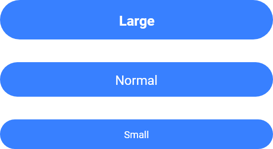

# Botón píldora


Para obtener un botón con forma de píldora con un color de fondo sólido y bordes redondeados solo debemos agregar la propiedad **shape** con el valor `GFButtonShape.pills` .

```dart
import 'package:getflutter/getflutter.dart';

GFButton(
    onPressed: (){},
    text: "primary",
    shape: GFButtonShape.pills,
  ),
```

## Botón sólido


El atributo **type** está definido por defecto como `GFButtonType.solid`, por lo tanto, obtendremos un botón con forma de píldora con un sólido color de fondo y bordes redondeados.

El callback disparado cuando se presiona el botón, definido en el atributo **onPressed**, habilita el botón.

```dart
import 'package:getflutter/getflutter.dart';

  GFButton(
    onPressed: (){},
    text: "primary",
    shape: GFButtonShape.pills,
  ),
```

### Botón deshabilitado


Si el atributo **onPressed** es null, entonces el botón estará deshabilitado. Por defecto, GFButton estará deshabilitado porque **onPressed** es null.

```dart
import 'package:getflutter/getflutter.dart';

GFButton(
    onPressed: null,
    text: "primary",
    shape: GFButtonShape.pills,
 ),
```

### Botón bloque



Block Button especifica cuan ancho debe ser el botón. Definiendo **blockButton** como `true`, el botón será un bloque de ancho máximo con bordes redondeados. Por defecto **blockButton** está definido como `false`.

```dart
import 'package:getflutter/getflutter.dart';

GFButton(
    onPressed: (){},
    text: "primary",
    shape: GFButtonShape.pills,
    blockButton: true,
 ),
```

### Botón de ancho máximo


Full Width Button especifica cuan ancho debe ser el botón. Definiendo **fullWidthButton** como `true`, el botón será un botón de ancho máximo con bordes redondeados y sin margen a los costados. Por defecto **fullWidthButton** está definido como `false`.

```dart
import 'package:getflutter/getflutter.dart';

GFButton(
    onPressed: (){},
    text: "primary",
    shape: GFButtonShape.pills,
    fullWidthButton: true,
 ),
```

### Tamaño del botón

El tamaño del botón puede ser modificado utilizando la propiedad **size**. El valor por defecto es `GFSize.MEDIUM`.

```dart
import 'package:getflutter/getflutter.dart';

GFButton(
    onPressed: (){},
    text: "primary",
    shape: GFButtonShape.pills,
    size: GFSize.SMALL,
 ),
```

## Botón Outline


Outline Button es un botón con fondo transparente y borde visible. Podemos obtener este botón facilmente definiedo el atributo **type** como **`GFButtonType.outline`**.

```dart
import 'package:getflutter/getflutter.dart';

GFButton(
    onPressed: (){},
    text: "primary",
    shape: GFButtonShape.pills,
    type: GFButtonType.outline,
 ),
```

Las propiedades antes mencionadas, como `size`, `blockButton`, `fullWidthButton`, habilitar y deshabilitar botones, funcionan también con **Outline Button**.

## Botón Outline 2x


Outline2x Button es un botón con fondo transparente y borde visible con un ancho de 2x. Podemos obtener este botón facilmente definiedo el atributo **type** como **`GFButtonType.outline2x`**.

```dart
import 'package:getflutter/getflutter.dart';

GFButton(
    onPressed: (){},
    text: "primary",
    shape: GFButtonShape.pills,
    type: GFButtonType.outline2x,
 ),
```

Las propiedades antes mencionadas, como `size`, `blockButton`, `fullWidthButton`, habilitar y deshabilitar botones, funcionan también con **Outline2x Button**.

