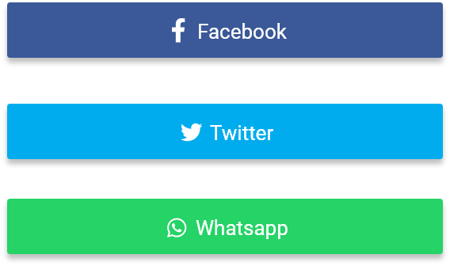

# Bot&oacute;n social


## Bot&oacute;n social full

El atributo **shape** est&aacute; definido por defecto como `GFButtonShape.standard`, por lo tanto, obtendremos un bot&oacute;n est&aacute;ndar con un s&oacute;lido color de fondo y bordes ligeramente redondeados.

### Bot&oacute;n social s&oacute;lido


El atributo **type** est&aacute; definido por defecto como `GFButtonType.solid`, por lo tanto, obtendremos un bot&oacute;n con s&oacute;lido color de fondo y bordes ligeramente redondeados.

El callback disparado cuando se presiona el bot&oacute;n, definido en el atributo **onPressed**, habilita el bot&oacute;n.

```dart
  import 'package:getflutter/getflutter.dart';

  GFButton(
    onPressed: (){},
    text: "primary",
    icon: Icon(Icons.share),
  ),
```

### Bot&oacute;n social deshabilitado


Si el atributo **onPressed** es null, entonces el bot&oacute;n estar&aacute; deshabilitado. Por defecto, GFButton estar&aacute; deshabilitado porque **onPressed** es null.

```dart
import 'package:getflutter/getflutter.dart';

GFButton(
    onPressed: null,
    text: "primary",
    icon: Icon(Icons.share),
 ),
```

### Bot&oacute;n social Outline


Outline Button es un bot&oacute;n con fondo transparente y borde visible. Podemos obtener este bot&oacute;n facilmente definiedo el atributo **type** como **`GFButtonType.outline`**.

```dart
import 'package:getflutter/getflutter.dart';

GFButton(
    onPressed: (){},
    text: "primary",
    icon: Icon(Icons.share),
    type: GFButtonType.outline,
 ),
```

### Bot&oacute;n social Outline 2x


Outline2x Button es un bot&oacute;n con fondo transparente y borde visible con un ancho de 2x. Podemos obtener este bot&oacute;n facilmente definiedo el atributo **type** como **`GFButtonType.outline2x`**.

```dart
import 'package:getflutter/getflutter.dart';

GFButton(
    onPressed: (){},
    text: "primary",
    icon: Icon(Icons.share),
    type: GFButtonType.outline2x,
 ),
```

### Bot&oacute;n social transparente


Definiendo el atributo **type** como **`GFButtonType.transparent`** obtenemos un bot&oacute;n transparente. Por defecto, GFButton define el atributo **type** como `GFButtonType.solid`.

```dart
import 'package:getflutter/getflutter.dart';

GFButton(
    onPressed: (){},
    text: "primary",
    icon: Icon(Icons.share),
    type: GFButtonType.transparent,
 ),
```

### Bot&oacute;n social p&iacute;ldora


Para obtener un bot&oacute;n con forma de p&iacute;ldora con un color de fondo s&oacute;lido y bordes redondeados solo debemos agregar la propiedad **shape** con el valor `GFButtonShape.pills`.

```dart
 import 'package:getflutter/getflutter.dart';

  GFButton(
    onPressed: (){},
    text: "primary",
    icon: Icon(Icons.share),
    shape: GFButtonShape.pills,
  ),
```

### Bot&oacute;n social cuadrado


Para obtener un bot&oacute;n cuadrado con un color de fondo s&oacute;lido sin bordes redondeados solo debemos agregar la propiedad **shape** con el valor `GFButtonShape.square`.

```dart
 import 'package:getflutter/getflutter.dart';

  GFButton(
    onPressed: (){},
    text: "primary",
    icon: Icon(Icons.share),
    shape: GFButtonShape.square,
  ),
```

###  Tama&ntilde;o de un bot&oacute;n social


El tama&ntilde;o del bot&oacute;n puede ser modificado utilizando la propiedad **size**. El valor por defecto es `GFSize.MEDIUM`.

```dart
import 'package:getflutter/getflutter.dart';

GFButton(
    onPressed: (){},
    text: "primary",
    icon: Icon(Icons.share),
    size: GFSize.SMALL,
 ),
```

### Bot&oacute;n social bloque



Block Button especifica cuan ancho debe ser el bot&oacute;n. Definiendo **blockButton** como `true`, el bot&oacute;n ser&aacute; un bloque de ancho m&aacute;ximo con bordes redondeados. Por defecto **blockButton** est&aacute; definido como `false`.

```dart
import 'package:getflutter/getflutter.dart';

GFButton(
    onPressed: (){},
    text: "primary",
    icon: Icon(Icons.share),
    type: GFButtonType.solid,
    blockButton: true,
 ),
```

### Bot&oacute;n de ancho m&aacute;ximo


Full Width Button especifica cuan ancho debe ser el bot&oacute;n. Definiendo **fullWidthButton** como `true`, el bot&oacute;n ser&aacute; un bot&oacute;n de ancho m&aacute;ximo con bordes redondeados y sin margen a los costados. Por defecto **fullWidthButton** est&aacute; definido como `false`.

```dart
import 'package:getflutter/getflutter.dart';

GFButton(
    onPressed: (){},
    text: "primary",
    icon: Icon(Icons.share),
    type: GFButtonType.solid,
    fullWidthButton: true,
 ),
```

## Bot&oacute;n social con &iacute;cono


Los botones solo con &iacute;conos tienen la funcionalidad est&aacute;ndar de un bot&oacute;n s&oacute;lido, y tienen un &iacute;cono como hijo.

El atributo **shape** est&aacute; definido por defecto como `GFButtonShape.standard`, por lo tanto, obtendremos un bot&oacute;n con forma est&aacute;ndar con un s&oacute;lido color de fondo y bordes ligeramente redondeados. El atributo **type** est&aacute; definido por defecto como `GFButtonType.solid`, por lo tanto, obtendremos un bot&oacute;n con un s&oacute;lido color de fondo y bordes ligeramente redondeados.

```dart
import 'package:getflutter/getflutter.dart';

GFIconButton(
    onPressed: (){},
    icon: Icon(Icons.share),
 ),
```

### Tama&ntilde;o

El tama&ntilde;o del bot&oacute;n puede ser modificado utilizando la propiedad **size**. El valor por defecto es `GFSize.MEDIUM`.

```dart
import 'package:getflutter/getflutter.dart';

GFIconButton(
    onPressed: (){},
    text: "primary",
    size: GFSize.small,
 ),
```

### Tipo

El tipo del bot&oacute;n puede ser cambiado definiedo la propiedad **type** como `GFButtonType.outline`. El valor por defecto es `GFButtonType.solid`.

```dart
import 'package:getflutter/getflutter.dart';

GFIconButton(
    onPressed: (){},
    text: "primary",
    type: GFButtonType.outline,
 ),
```

### Forma

La forma del bot&oacute;n puede ser cambiada definiendo la propiedad **shape** to `GFIconButtonShape.circle`. El valor por defecto es `GFIconButtonShape.standard`, con lo cual obtenemos un bot&oacute;n cuadrado con los bordes ligeramente redondeados.

```dart
import 'package:getflutter/getflutter.dart';

GFIconButton(
    onPressed: (){},
    text: "primary",
    shape: GFIconButtonShape.pills,
 ),
```
