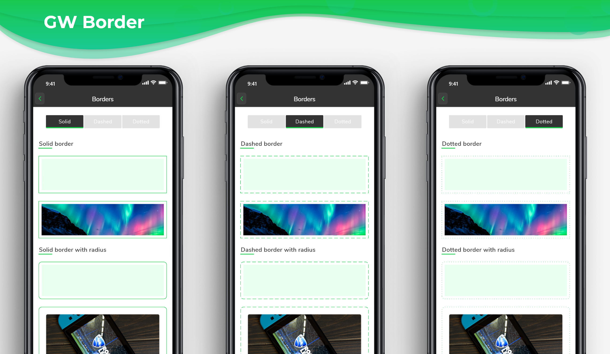
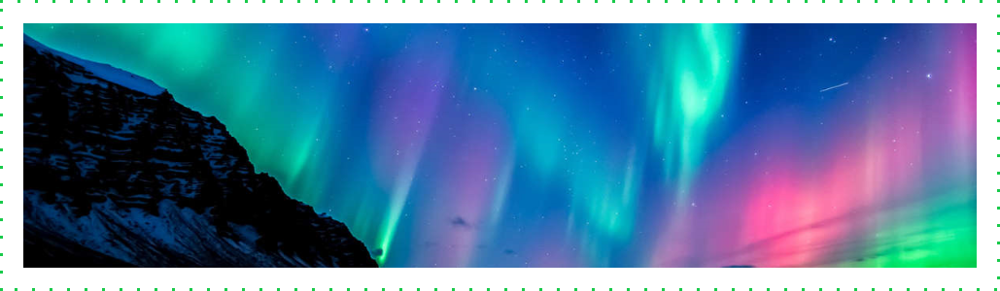
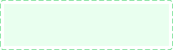
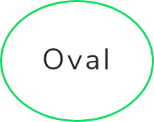

# GF Border

### GF Border Info



### Usage

The simple code of a basic GFBorder is as shown below.

### Solid Border

Solid Border is basic border used for the many components. GF Border property `[dashedLine`\] takes array of doubles like  `[2, 0]` to display solid border.


```text
Container(
  margin: EdgeInsets.symmetric(
      horizontal: 15, vertical: 15),
  child: GFBorder(
    color: Color(0xFF19CA4B),
    dashedLine: [2, 0],
    type: GFBorderType.rect,
    child: Image.asset(
      'assets image here',
      width: MediaQuery.of(context).size.width,
      fit: BoxFit.fitWidth,
    ),
  ),
),
```

### Dashed Border

Dashed Border is customised border with dashed patterns used in UI designs. GF Border property `[dashedLine`\] takes array of doubles like `[4, 6]` to display dashed border.


```text
Container(
  margin: EdgeInsets.symmetric(
      horizontal: 15, vertical: 15),
  child: GFBorder(
    dashedLine: [4, 6],
    type: GFBorderType.rect,
    color: Color(0xFF19CA4B),
    child: Image.asset(
      'assets image here',
      width: MediaQuery.of(context).size.width,
      fit: BoxFit.fitWidth,
    ),
  ),
),
```

### Dotted Border

Dotted Border is customised border with dotted patterns used in many UI designs. GF Border property `[dashedLine`\] takes array of doubles like `[2, 1]` to display dotted border.



```text
Container(
  margin: EdgeInsets.symmetric(
      horizontal: 15, vertical: 15),
  child: GFBorder(
    color: Color(0xFF19CA4B),
    dashedLine: [2, 1],
    type: GFBorderType.rect,
    child: Image.asset(
      'assets image here',
      width: MediaQuery.of(context).size.width,
      fit: BoxFit.fitWidth,
    ),
  ),
),
```

### GF Border Types

### GFBorderType.rect


GF Border property `type` takes `GFBorderType.rect` to display borders with no rounded corner.

```text
Container(
  margin: EdgeInsets.symmetric(
      horizontal: 15, vertical: 15),
  child: GFBorder(
    color: Color(0xFF19CA4B),
    dashedLine: [2, 0],
    type: GFBorderType.rect,
    child: Container(
      height: 100,
      color: Color(0xFFE9FFEF),
    ),
  ),
),
```

### GFBorderType.rRect



GF Border property `type` takes `GFBorderType.rRect` to display borders with rounded corner.

```text
Container(
  margin: EdgeInsets.symmetric(
      horizontal: 15, vertical: 15),
  child: GFBorder(
    radius: Radius.circular(20),
    color: Color(0xFF19CA4B),
    dashedLine: [2, 0],
    type: GFBorderType.rRect,
    child: Container(
      height: 100,
      color: Color(0xFFE9FFEF),
    ),
  ),
),
```

### GFBorderType.oval



GF Border property `type` takes `GFBorderType.oval` to display oval shape borders.

```text
Container(
  width: 50,
  height: 60,
  child: GFBorder(
    type: GFBorderType.oval,
    dashedLine: [2, 0],
    color: Color(0xFF19CA4B),
    strokeWidth: 2,
    child: Center(child: Text('Oval Border')),
  ),
),
```

### GFBorderType.circle


GF Border property `type` takes `GFBorderType.circle` to display circular shape borders.

```text
Container(
  width: 100,
  height: 100,
  child: GFBorder(
    type: GFBorderType.circle,
    dashedLine: [4, 6],
    color: Color(0xFF19CA4B),
    strokeWidth: 2,
    child: Center(
        child: Text(
      'Circular Border',
      textAlign: TextAlign.center,
    )),
  ),
),
```

### Custom Properties

Look and feel of the **GFBorder** can be customized using the GFBorder properties.

|  |  |
| :--- | :--- |
| **child** | child of  type \[Widget\] which can be any component or text, etc |
| **padding** | padding for \[child\] where in padding is given to the border types |
| **strokeWidth** | storkeWidth of type \[double\] which is used to define the thickness of the border |
| **color** | color of type \[Color\] or GFColor which is used to change the color of the border type |
| **dashedLine** | dashedLine of type \[List&lt;double&gt;\] which is used for the linear and simple dashed line of border |
| **type** | type of \[GFBorderType\] which is used to define the different types of borders ie, circle, Rect, RRect and oval |
| **radius** | radius of type \[Radius\] used to give a curved border only when the border type is RRect, in other cases radius will not work |


