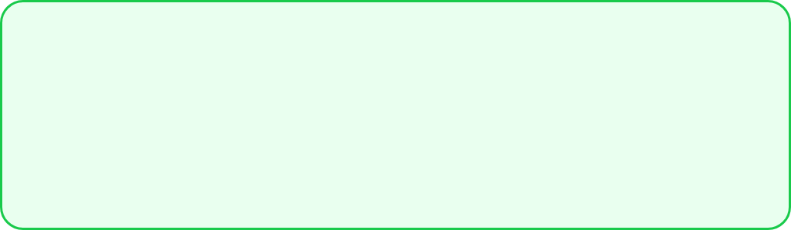
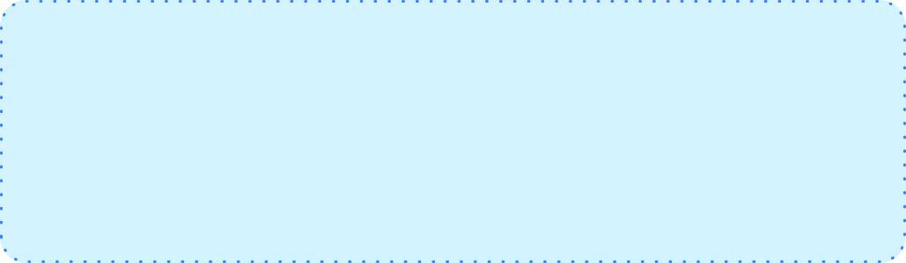

# GF Border

### GF Border Info


### Usage

The simple code of a basic GFBorder is as shown below.



```text
GFBorder(
    type: GFBorderType.Rect,
    dashedLine: [2, 0],
    child: Text('Basic Border')
),
```

### Dashed Border


```text
GFBorder(
    type: GFBorderType.Rect,
    dashedLine: [4, 6],
    child: Text('Dashed Border')
),
```

### Dotted Border



```text
GFBorder(
    type: GFBorderType.Rect,
    dashedLine: [2, 1],
    child: Text('Dotted Border')
),
```

### Custom Properties

Look and feel of the **GFBorder** can be customized using the GFBorder properties.

|  |  |
| :--- | :--- |
| **child** | child of  type \[Widget\] which can be any component or text, etc |
| **padding** | padding of time \[EdgeInsets\] where in padding is given to the border types |
| **strokeWidth** | storkeWidth of type \[double\] which is used to define the thickness of the border |
| **color** | color of type \[Color\] or GFColor which is used to change the color of the border type |
| **dashedLine** | dashedLine of type \[List&lt;double&gt;\] which is used for the linear and simple dashed line of border |
| **type** | type of \[GFBorderType\] which is used to define the different types of borders ie, circle, Rect, RRect and oval |
| **radius** | radius of type \[Radius\] used to give a curved border only when the border type is RRect, in other cases radius will not work |
| **customPath** | customPath of type \[PathBuilder\] used for drawing the paths |


