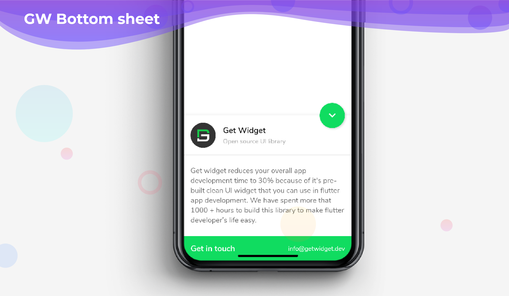

# GF Bottomsheet

### GF Bottomsheet Info



### Usage

The simple code of a basic GFBottomsheet is as shown below.


```text
Scaffold(
  bottomSheet: GFBottomSheet(
    controller: _controller,
    maxContentHeight: 150,
    enableExpandableContent: true,
    stickyHeaderHeight: 100,
    stickyHeader: Container(
      decoration: BoxDecoration(color: Colors.white,
          boxShadow: [BoxShadow(color: Colors.black45, blurRadius: 0)]
      ),
      child: const GFListTile(
        avatar: GFAvatar(
          backgroundImage: AssetImage('assets image here'),
        ),
        titleText: 'GetWidget',
        subtitleText: 'Open source UI library',
      ),
    ),
    contentBody: Container(
      height: 200,
      margin: EdgeInsets.symmetric(horizontal: 15, vertical: 10),
      child: ListView(
        shrinkWrap: true,
        physics: const ScrollPhysics(),
        children: const [
          Center(
              child: Text(
                'Getwidget reduces your overall app development time to minimum 30% because of its pre-build clean UI widget that you can use in flutter app development. We have spent more than 1000+ hours to build this library to make flutter developer’s life easy.',
                style: TextStyle(
                    fontSize: 15, wordSpacing: 0.3, letterSpacing: 0.2),
              ))
        ],
      ),
    ),
    stickyFooter: Container(
      color: GFColors.SUCCESS,
      child: Row(
        mainAxisAlignment: MainAxisAlignment.spaceEvenly,
        children: [
          Text(
            'Get in touch',
            style: TextStyle(
                fontSize: 18,
                fontWeight: FontWeight.bold,
                color: Colors.white),
          ),
          Text(
            'info@getwidget.dev',
            style: TextStyle(fontSize: 15, color: Colors.white),
          ),
        ],
      ),
    ),
    stickyFooterHeight: 50,
  ),
  floatingActionButton: FloatingActionButton(
      backgroundColor: GFColors.SUCCESS,
      child: _controller.isBottomSheetOpened ? Icon(Icons.keyboard_arrow_down):Icon(Icons.keyboard_arrow_up),
      onPressed: () {
        _controller.isBottomSheetOpened
            ? _controller.hideBottomSheet()
            : _controller.showBottomSheet();
      }
      ),
)
```

### Custom Properties

Look and feel of the **GFBottomsheet** can be customized using the GFBottomsheet properties.

<table>
  <thead>
    <tr>
      <th style="text-align:left"></th>
      <th style="text-align:left"></th>
    </tr>
  </thead>
  <tbody>
    <tr>
      <td style="text-align:left"><b>minContentHeight</b>
      </td>
      <td style="text-align:left">
        <p>[minContentHeight] controls the minimum height of the content body.</p>
        <p>Content body with [minContentHeight] displays only when [enableExpandableContent]
          is false.</p>
        <p>It Must be greater or equal to 0. Default value is 0.</p>
      </td>
    </tr>
    <tr>
      <td style="text-align:left"><b>maxContentHeight</b>
      </td>
      <td style="text-align:left">
        <p>[maxContentHeight] controls the maximum height of the content body.</p>
        <p>It Must be greater or equal to 0. Default value is 300.</p>
      </td>
    </tr>
    <tr>
      <td style="text-align:left"><b>stickyHeader</b>
      </td>
      <td style="text-align:left">
        <p>[stickyHeader] is the header of GFBottomSheet.</p>
        <p>User can interact by swiping or tapping the [stickyHeader]</p>
      </td>
    </tr>
    <tr>
      <td style="text-align:left"><b>contentBody</b>
      </td>
      <td style="text-align:left">
        <p>[contentBody] is the body of GFBottomSheet.</p>
        <p>User can interact by swiping or tapping the [contentBody]</p>
      </td>
    </tr>
    <tr>
      <td style="text-align:left"><b>stickyFooter</b>
      </td>
      <td style="text-align:left">
        <p>[stickyFooter] is the footer of GFBottomSheet.</p>
        <p>User can interact by swiping or tapping the [stickyFooter]</p>
      </td>
    </tr>
    <tr>
      <td style="text-align:left"><b>stickyFooterHeight</b>
      </td>
      <td style="text-align:left">[stickyFooterHeight] defines the height of GFBottomSheet&apos;s [stickyFooter]</td>
    </tr>
    <tr>
      <td style="text-align:left"><b>stickyHeaderHeight</b>
      </td>
      <td style="text-align:left">[stickyHeaderHeight] defines the height of GFBottomSheet&apos;s [stickyHeader]</td>
    </tr>
    <tr>
      <td style="text-align:left"><b>elevation</b>
      </td>
      <td style="text-align:left">
        <p>[elevation] controls shadow below the GFBottomSheet material.</p>
        <p>Must be greater or equal to 0. Default value is 0.</p>
      </td>
    </tr>
    <tr>
      <td style="text-align:left"><b>enableExpandableContent</b>
      </td>
      <td style="text-align:left">
        <p>[enableExpandableContent] allows [contentBody] to expand.</p>
        <p>Default value is false.</p>
      </td>
    </tr>
    <tr>
      <td style="text-align:left"><b>controller</b>
      </td>
      <td style="text-align:left">[controller] used to control GFBottomSheet behavior like hide/show</td>
    </tr>
    <tr>
      <td style="text-align:left"><b>animationDuration</b>
      </td>
      <td style="text-align:left">
        <p>Defines the drag animation duration of the GFBottomSheet</p>
        <p>Default value is 300.</p>
      </td>
    </tr>
  </tbody>
</table>

