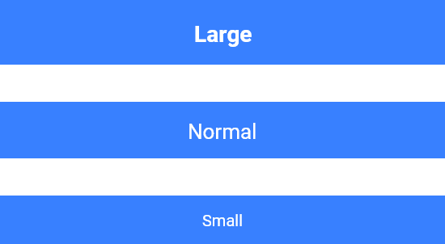

# Square Button


We will able to get square shaped button with solid background color with no rounded corners by adding property **shape** with  `GFButtonShape.square` .

```dart
import 'package:getwidget/getwidget.dart';

GFButton(
    onPressed: (){},
    text: "primary",
    shape: GFButtonShape.square,
  ),
```

## Solid Button


By default, button **type** set to `GFButtonType.solid` so, we able to get square shaped button have a solid background color with  no rounded corners.

The callback that is called when the button is tapped. By adding callback to **onPressed** enables the button.

```dart
import 'package:getwidget/getwidget.dart';
  
  GFButton(
    onPressed: (){},
    text: "primary",
    shape: GFButtonShape.square,
  ),
```

### Disabled Button


If this callback and **onPressed** are null, then the button will be disabled. Default GFButton will be disabled because, **onPressed** set to null. 

```dart
import 'package:getwidget/getwidget.dart';

GFButton(
    onPressed: null,
    text: "primary",
    shape: GFButtonShape.square,
 ),
```

### Block Button



Block button specify how wide the button should be. By setting **blockButton** state `true`, it will change the button to a full-width block with no rounded corners. Default **blockButton** set to `false`.

```dart
import 'package:getwidget/getwidget.dart';

GFButton(
    onPressed: (){},
    text: "primary",
    shape: GFButtonShape.square,
    blockButton: true,
 ),
```

### Full Width Button


Full Width button specify how wide the button should be. By setting **fullWidthButton** state `true`, it will change the button to a Full-width button with no rounded corners and no border on the left or right. Default **fullWidthButton** set to `false`.

```dart
import 'package:getwidget/getwidget.dart';

GFButton(
    onPressed: (){},
    text: "primary",
    shape: GFButtonShape.square,
    fullWidthButton: true,
 ),
```

### Button Size

Button size can be varied using **size** property, which specifies the size of the button. Default button size set to `GFSize.MEDIUM`.

```dart
import 'package:getwidget/getwidget.dart';

GFButton(
    onPressed: (){},
    text: "primary",
    shape: GFButtonShape.square,
    size: GFSize.SMALL,
 ),
```

## Outline Button


Outline Button describes as the Button with a transparent background and a visible border. This button can be easily get in GFButton by adding **type** as **`GFButtonType.outline`**. 

```dart
import 'package:getwidget/getwidget.dart';

GFButton(
    onPressed: (){},
    text: "primary",
    shape: GFButtonShape.square,
    type: GFButtonType.outline,
 ),
```

Above mentioned all the properties like `size`, `blockButton`, `fullWidthButton`, enabling and disabling of button works fine in **Outline Button** also.

## Outline2x Button


Outline2x Button describes as the Button with a transparent background and a visible border with 2x border-width. This button can be easily get in GFButton by adding **type** as **`GFButtonType.outline2x`**. 

```dart
import 'package:getwidget/getwidget.dart';

GFButton(
    onPressed: (){},
    text: "primary",
    shape: GFButtonShape.square,
    type: GFButtonType.outline2x,
 ),
```

Above mentioned all the properties like `size`, `blockButton`, `fullWidthButton`, enabling and disabling of button works fine in **Outline2x Button** also.

