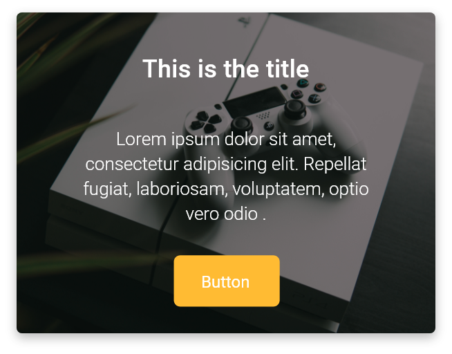

# GF Card


### Usage

Below code gives the basic GFCard

```dart
import 'package:getwidget/getwidget.dart';
  
GFCard(
 boxFit: BoxFit.cover,
 image: Image.asset('your asset image'),
 title: GFListTile(
   avatar: GFAvatar(
     backgroundImage: AssetImage('your asset image'),
   ),
   title: Text('Card Title'),
   subTitle: Text('Card Sub Title'),
),
content: Text("Some quick example text to build on the card"),
buttonBar: GFButtonBar(
 children: <Widget>[
   GFButton(
    onPressed: () {},
    text: 'Buy',
   ),
   GFButton(
    onPressed: () {},
    text: 'Cancel',
   ),
 ],
 ),
),
```

### GFCards with Avatar


```dart
import 'package:getwidget/getwidget.dart';
  
 GFCard(
   boxFit: BoxFit.cover,
   titlePosition: GFPosition.start,
   image: Image.asset('your asset image'),
   title: GFListTile(
     avatar: GFAvatar(
       backgroundImage: AssetImage('your asset image'),
     ),
     titleText: 'Game Controllers',
     subtitleText: 'PlayStation 4',
    ),
    content: Text( "Some quick example text to build on the card"),
    buttonBar: GFButtonBar(
      children: <Widget>[
        GFAvatar(
          backgroundColor: GFColors.PRIMARY,
          child: Icon(Icons.share, color: Colors.white,),
        ),
        GFAvatar(
          backgroundColor: GFColors.SECONDARY,
          child: Icon(Icons.search, color: Colors.white,),
        ),
        GFAvatar(
           backgroundColor: GFColors.SUCCESS,
           child: Icon(Icons.phone, color: Colors.white,),
        ),
    ],
  ),
),
```

### GFCards with OverlayImage



```dart
import 'package:getwidget/getwidget.dart';
  
  GFCard(
    boxFit: BoxFit.cover,
    imageOverlay: AssetImage('your asset image'),
    title: GFListTile(
       title: Text('Card Title'),
     ),
     content: Text("GFCards has three types of cards i.e, basic, with avataras and with overlay image")
     buttonBar: GFButtonBar(
     alignment: MainAxisAlignment.center,
     children: <Widget>[
     GFButton(
       onPressed: () {},
       text: 'View',
       )
      ],
     ),
   ),
```

### Custom Properties

|  |  |
| :--- | :--- |
| **titlePosition** | helps to set the title at  top of the card |
| **color** | sets the background color of the card |
| **elevation** | controls the size of the shadow below the card |
| **shape** | shape of the card |
| **borderOnForeground** | whether to paint the shape of the border in front of the child, defaults to true |
| **clipBehaviour** | defines the clipping of the child |
| **margin** | defines the card's outer container margin |
| **padding** | defines the card's outer container padding |
| **semanticContainer** | represents a single semantic container, if false a collection of semantic nodes |
| **border** | to draw border above the card |
| **borderRadius** | represents the rounded corners of the card |
| **colorFilter** | applies to the image before painting it |
| **boxFit** | how the image should be inscribed into the box |
| **imageOverlay** | display images as background with shaded overlay |

