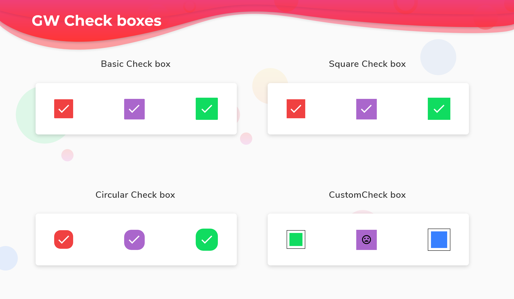
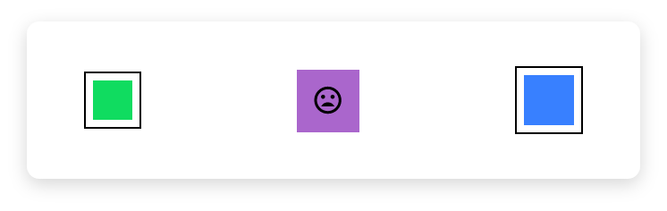

# GF Checkbox

## GF Checkbox Info



### Usage

The simple code of a basic GFCheckbox is as shown below.

```text
bool isChecked = false;

GFCheckbox(
  size: GFSize.SMALL,
  activeBgColor: GFColors.DANGER,
  onChanged: (value) {
    setState(() {
      isChecked = value;
    });
  },
  value: isChecked,
),
```

### Basic Checkbox


```text
bool isChecked = false;

GFCard(
 content: Row(
 mainAxisAlignment: MainAxisAlignment.spaceBetween,
 children: <Widget>[
   GFCheckbox(
     size: GFSize.SMALL,
     activeBgColor: GFColors.DANGER,
     onChanged: (value) {
       setState(() {
         isChecked = value;
       });
     },
     value: isChecked,
     inactiveIcon: null,
   ),
  GFCheckbox(
    activeBgColor: GFColors.SECONDARY,
    onChanged: (value) {
      setState(() {
        isChecked = value;
      });
    },
    value: isChecked,
    inactiveIcon: null,
   ),
   GFCheckbox(
     size: GFSize.LARGE,
     activeBgColor: GFColors.SUCCESS,
     onChanged: (value) {
       setState(() {
         isChecked = value;
       });
     },
     value: isChecked,
     inactiveIcon: null,
    ),
   ],
  ),
),
```

### Square Checkbox


```text
bool isChecked = false;

GFCard(
  content: Row(
    mainAxisAlignment: MainAxisAlignment.spaceBetween,
    children: <Widget>[
      GFCheckbox(
        size: GFSize.SMALL,
        activeBgColor: GFColors.DANGER,
        type: GFCheckboxType.square,
        onChanged: (value) {
          setState(() {
            isChecked = value;
          });
        },
        value: isChecked,
        inactiveIcon: null,
      ),
      GFCheckbox(
        type: GFCheckboxType.square,
        activeBgColor: GFColors.SECONDARY,
        onChanged: (value) {
          setState(() {
            isChecked = value;
          });
        },
        value: isChecked,
        inactiveIcon: null,
      ),
      GFCheckbox(
        size: GFSize.LARGE,
        activeBgColor: GFColors.SUCCESS,
        type: GFCheckboxType.square,
        onChanged: (value) {
          setState(() {
            isChecked = value;
          });
        },
        value: isChecked,
        inactiveIcon: null,
      ),
    ],
  ),
),
```

### Circular Checkbox


```text
bool isChecked = false;

GFCard(
  content: Row(
    mainAxisAlignment: MainAxisAlignment.spaceBetween,
    children: <Widget>[
      GFCheckbox(
        size: GFSize.SMALL,
        activeBgColor: GFColors.DANGER,
        type: GFCheckboxType.circle,
        onChanged: (value) {
          setState(() {
            isChecked = value;
          });
        },
        value: isChecked,
        inactiveIcon: null,
      ),
      GFCheckbox(
        type: GFCheckboxType.circle,
        activeBgColor: GFColors.SECONDARY,
        onChanged: (value) {
          setState(() {
            isChecked = value;
          });
        },
        value: isChecked,
      ),
      GFCheckbox(
        activeBgColor: GFColors.SUCCESS,
        size: GFSize.LARGE,
        type: GFCheckboxType.circle,
        onChanged: (value) {
          setState(() {
            isChecked = value;
          });
        },
        value: isChecked,
        inactiveIcon: null,
      ),
    ],
  ),
),
```

### Custom Checkbox



```text
bool isChecked = false;

GFCard(
  content: Row(
    mainAxisAlignment: MainAxisAlignment.spaceBetween,
    children: <Widget>[
      GFCheckbox(
        size: GFSize.SMALL,
        type: GFCheckboxType.custom,
        onChanged: (value) {
          setState(() {
            isChecked = value;
          });
        },
        value: isChecked,
        inactiveIcon: null,
      ),
      GFCheckbox(
        type: GFCheckboxType.square,
        activeBgColor: GFColors.SECONDARY,
        activeIcon: Icon(Icons.sentiment_satisfied),
        onChanged: (value) {
          setState(() {
            isChecked = value;
          });
        },
        value: isChecked,
        inactiveIcon: Icon(Icons.sentiment_dissatisfied),
      ),
      GFCheckbox(
        size: GFSize.MEDIUM,
        type: GFCheckboxType.custom,
        onChanged: (value) {
          setState(() {
            isChecked = value;
          });
        },
        value: isChecked,
        custombgColor: GFColors.INFO,
      ),
    ],
  ),
),
```

### Custom Properties

Look and feel of the **GFCheckbox** can be customized using the GFCheckbox properties.

|  |  |
| :--- | :--- |
| **type** | type of \[GFCheckboxType\] which is of four type is basic, square, circular and custom |
| **size** | type of \[double\] which is GFSize ie, small, medium and large and can use any double value |
| **checkColor** | type of \[Color\] used to change the checkcolor when the checkbox is active |
| **activeBgColor** | type of \[Color\] used to change the backgroundColor of the active checkbox |
| **inactiveBgColor** | type of \[Color\] used to change the backgroundColor of the inactive checkbox |
| **activeBorderColor** | type of \[Color\] used to change the border color of the active checkbox |
| **inactiveBorderColor** | type of \[Color\] used to change the border color of the inactive checkbox |
| **onChanged** | called when the user checks or unchecks the checkbox. |
| **value** | used to set the current state of the checkbox |
| **activeIcon** | type of \[Widget\] used to change the  checkbox's active icon |
| **inactiveIcon** | type of \[Widget\] used to change the  checkbox's inactive icon |
| **customBgColor** | type of \[Color\] used to change the background color of the custom active checkbox only |
| **autofocus** | on true state this widget will be selected as the initial focus when no other node in its scope is currently focused |
| **focusNode** | an optional focus node to use as the focus node for this widget. |

