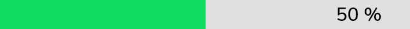

# GF Progress Bar


Progress bar can be of two types , a simple linear progress bar or a Circular Progress bar

### Usage

The below code shows a simple **Linear** **progress** **bar** with some defined properties of the progress bar.

```dart
 import 'package:getwidget/getwidget.dart';

 GFProgressBar(
     percentage: 0.9,
     backgroundColor : Colors.black26,
     progressBarColor: GFColors.DANGER
)
```

###  



### Circular Progress Bar

Circular progress bar is as same as linear progress bar with some additional properties added to the code structure. The below code shows a simple circular progress bar.

```dart
import 'package:getwidget/getwidget.dart';

 GFProgressBar(
     percentage: 0.9,
     width:100,
     radius: 90,
     backgroundColor : Colors.black26,
     progressBarColor: GFColors.DANGER
)
```

### 


### Progress bar with Child property

The progress bar can be customized to show the percentage of progress completed. To show the progress percentage we can use child property which is a Widget type and can be a text, icon , image etc. The below code shows how a child property can be used as text to show the progress percentage.

```dart
import 'package:getwidget/getwidget.dart';
 
GFProgressBar(
    percentage: 0.5,
    lineHeight: 20,
    child: const Padding(
        padding: EdgeInsets.only(right: 5),
        child: Text('50%', textAlign: TextAlign.end,
                    style: TextStyle(fontSize: 16, color: Colors.white),
               ),
        ),
     backgroundColor: Colors.black26,
     progressBarColor: GFColors.WARNING,
)
```

### 


### Progress bar with leading and trailing icons

The progress bar can be used with leading and trailing icons to show the level of progress percent from 0 to 1. The below code shows a leading and trailing icons in a Linear Progress bar.

```dart
import 'package:getwidget/getwidget.dart';

GFProgressBar(
     percentage: 0.8,
     lineHeight: 20,
     alignment: MainAxisAlignment.spaceBetween,
     child: const Text('80%', textAlign: TextAlign.end,
                  style: TextStyle(fontSize: 16, color: Colors.white),
                  ),
     leading  : Icon( Icons.sentiment_dissatisfied, color: GFColors.DANGER),
     trailing: Icon( Icons.sentiment_satisfied, color: GFColors.SUCCESS),
     backgroundColor: Colors.black26,
     progressBarColor: GFColors.INFO,
)
```

### 


### 

### Custom Properties

|  |  |
| :--- | :--- |
| **percentage** | type of double which should be from 0 to 1 to indicate the progress percentage |
| **radius** | type of double used to show the radius of the Circular Progress Bar |
| **width** | defines the width of the progress bar |
| **type** | type of \[GFProgressType\] which changes the shape of progress bar ie , linear or circular |
| **lineHeight** | defines the height of the progress bar |
| **circleWidth** | defines the thickness of the circle's arc in Circular Progress bar |
| **circleStartAngle** | defines the angle on which the circle starts to progress in degrees.\(ie 0.0, 45.0, 90.0 etc\) |
| **animation** | type of bool which allows the progress line to animate when the percentage value is changed, default is false |
| **animationDuration** | duration of animation in milliseconds , applicable only if animation is true |
| **alignment** | used to align the leading and trailing widget which the progress bar evenly |
| **padding** | defines the padding of the progress bar |
| **animateFromLastPercentage** | type of bool which is used to animate the progress bar from the last percentage value set |
| **linearGradient** | linear gardient colors given to the progress line color |
| **autoLive** | set to false if you don't want to preserve the state of the widget , default is true |
| **fromRightToLeft** | set to true if you want to animate the linear progress bar from right to left  |
| **mask** | Creates a mask filter that takes the progress shape being drawn and blurs it |
| **clipLinearGradient** | set to true if you want to display only a part of \[linearGradient\] based on percentage value,  |
| **progressHeadType** | type of \[GFProgressHeadType\] which changes the shape of the progress head ie ,  circular or sqaure |
| **reverse** | type to bool which is used to display the progress in reverse direction |

