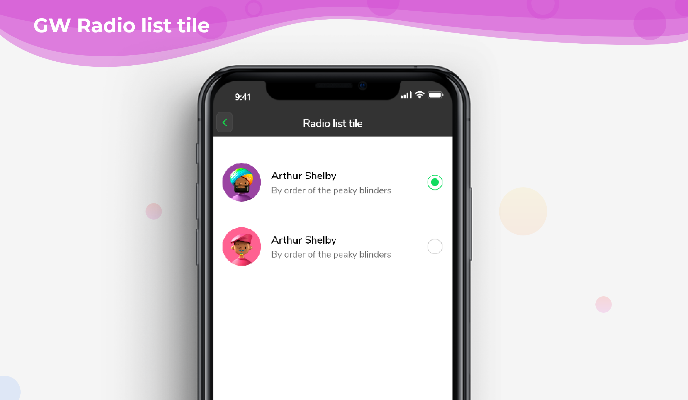

# GF Radio ListTile

## GF Radio ListTile Info



### Usage

The simple code of a basic GFRadioListTile is as shown below.


```text
int groupValue = 0;

GFRadioListTile(
  titleText: 'Arthur Shelby',
  subtitleText: 'By order of the peaky blinders',
  avatar: GFAvatar(
    backgroundImage: AssetImage('Assets image here'),
  ),
  size: 25,
  activeBorderColor: Colors.green,
  focusColor: Colors.green,
  type: GFRadioType.square,
  value: 0,
  groupValue: groupValue,
  onChanged: (value) {
    setState(() {
      groupValue = value;
    });
  },
  inactiveIcon: null,
),
GFRadioListTile(
  titleText: 'Arthur Shelby',
  subtitleText: 'By order of the peaky blinders',
  avatar: GFAvatar(
    backgroundImage: AssetImage('Assets image here'),
  ),
  size: 25,
  activeBorderColor: Colors.green,
  focusColor: Colors.green,
  type: GFRadioType.square,
  value: 1,
  groupValue: groupValue,
  onChanged: (value) {
    setState(() {
      groupValue = value;
    });
  },
  inactiveIcon: null,
),
```

### Custom Properties

Look and feel of the **GFRadioListTile** can be customized using the GFRadioListTile properties.

<table>
  <thead>
    <tr>
      <th style="text-align:left"></th>
      <th style="text-align:left"></th>
    </tr>
  </thead>
  <tbody>
    <tr>
      <td style="text-align:left"><b>type</b>
      </td>
      <td style="text-align:left">type of [GFRadioType] which is of four type is basic, sqaure, circular
        and custom</td>
    </tr>
    <tr>
      <td style="text-align:left"><b>size</b>
      </td>
      <td style="text-align:left">type of [double] which is GFSize ie, small, medium and large and can use
        any double value</td>
    </tr>
    <tr>
      <td style="text-align:left"><b>radioColor</b>
      </td>
      <td style="text-align:left">type pf [Color] used to change the checkcolor when the radio button is
        active</td>
    </tr>
    <tr>
      <td style="text-align:left"><b>activebgColor</b>
      </td>
      <td style="text-align:left">type of [Color] used to change the backgroundColor of the active radio
        button</td>
    </tr>
    <tr>
      <td style="text-align:left"><b>inactivebgColor</b>
      </td>
      <td style="text-align:left">type of [Color] used to change the backgroundColor of the inactive radio
        button</td>
    </tr>
    <tr>
      <td style="text-align:left"><b>activeBorderColor</b>
      </td>
      <td style="text-align:left">type of [Color] used to change the border color of the active radio button</td>
    </tr>
    <tr>
      <td style="text-align:left"><b>inactiveBorderColor</b>
      </td>
      <td style="text-align:left">type of [Color] used to change the border color of the inactive radio
        button</td>
    </tr>
    <tr>
      <td style="text-align:left"><b>onChanged</b>
      </td>
      <td style="text-align:left">Called when the user checks or unchecks the radio button</td>
    </tr>
    <tr>
      <td style="text-align:left"><b>activeIcon</b>
      </td>
      <td style="text-align:left">type of Widget used to change the radio button&apos;s active icon</td>
    </tr>
    <tr>
      <td style="text-align:left"><b>inactiveIcon</b>
      </td>
      <td style="text-align:left">type of [Widget] used to change the radio button&apos;s inactive icon</td>
    </tr>
    <tr>
      <td style="text-align:left"><b>custombgColor</b>
      </td>
      <td style="text-align:left">type of [Color] used to change the background color of the custom active
        radio button only</td>
    </tr>
    <tr>
      <td style="text-align:left"><b>autofocus</b>
      </td>
      <td style="text-align:left">on true state this widget will be selected as the initial focus when no
        other node in its scope is currently focused</td>
    </tr>
    <tr>
      <td style="text-align:left"><b>focusNode</b>
      </td>
      <td style="text-align:left">an optional focus node to use as the focus node for this widget.</td>
    </tr>
    <tr>
      <td style="text-align:left"><b>value</b>
      </td>
      <td style="text-align:left">The value represented by this radio button.</td>
    </tr>
    <tr>
      <td style="text-align:left"><b>groupValue</b>
      </td>
      <td style="text-align:left">The currently selected value for a group of radio buttons. Radio button
        is considered selected if its [value] matches the [groupValue].</td>
    </tr>
    <tr>
      <td style="text-align:left"><b>toggleable</b>
      </td>
      <td style="text-align:left">sets the radio value</td>
    </tr>
    <tr>
      <td style="text-align:left"><b>titleText</b>
      </td>
      <td style="text-align:left">type of [String] used to pass text, alternative to title property and
        gets higher priority than title</td>
    </tr>
    <tr>
      <td style="text-align:left"><b>subtitleText</b>
      </td>
      <td style="text-align:left">type of [String] used to pass text, alternative to subtitle property and
        gets higher priority than subtitle</td>
    </tr>
    <tr>
      <td style="text-align:left"><b>color</b>
      </td>
      <td style="text-align:left">The GFListTile&apos;s background color. Can be given [Color] or [GFColors]</td>
    </tr>
    <tr>
      <td style="text-align:left"><b>avatar</b>
      </td>
      <td style="text-align:left">type of [Widget] or [GFAvatar] used to create rounded user profile</td>
    </tr>
    <tr>
      <td style="text-align:left"><b>title</b>
      </td>
      <td style="text-align:left">The title to display inside the [GFListTile].</td>
    </tr>
    <tr>
      <td style="text-align:left"><b>subTitle</b>
      </td>
      <td style="text-align:left">The subTitle to display inside the [GFListTile].</td>
    </tr>
    <tr>
      <td style="text-align:left"><b>description</b>
      </td>
      <td style="text-align:left">The description to display inside the [GFListTile].</td>
    </tr>
    <tr>
      <td style="text-align:left"><b>icon</b>
      </td>
      <td style="text-align:left">The icon to display inside the [GFListTile].</td>
    </tr>
    <tr>
      <td style="text-align:left"><b>margin</b>
      </td>
      <td style="text-align:left">defines the margin of GFListTile</td>
    </tr>
    <tr>
      <td style="text-align:left"><b>padding</b>
      </td>
      <td style="text-align:left">defines the padding of GFListTile</td>
    </tr>
    <tr>
      <td style="text-align:left"><b>enabled</b>
      </td>
      <td style="text-align:left">
        <p>Whether this list tile is interactive. If false, this list tile is styled
          with the disabled color from the current [Theme] and the [onTap] and [onLongPress]
          callbacks are</p>
        <p>inoperative.</p>
      </td>
    </tr>
    <tr>
      <td style="text-align:left"><b>onTap</b>
      </td>
      <td style="text-align:left">Called when the user taps this list tile. Inoperative if [enabled] is
        false.</td>
    </tr>
    <tr>
      <td style="text-align:left"><b>onLongPress</b>
      </td>
      <td style="text-align:left">Called when the user long-presses on this list tile. Inoperative if [enabled]
        is false.</td>
    </tr>
    <tr>
      <td style="text-align:left"><b>selected</b>
      </td>
      <td style="text-align:left">
        <p>If this tile is also [enabled] then icons and text are rendered with the
          same color.</p>
        <p>By default the selected color is the theme&apos;s primary color. The selected
          color</p>
        <p>can be overridden with a [ListTileTheme].</p>
      </td>
    </tr>
    <tr>
      <td style="text-align:left"><b>focusColor</b>
      </td>
      <td style="text-align:left">The color for the tile&apos;s [Material] when it has the input focus.</td>
    </tr>
    <tr>
      <td style="text-align:left"><b>hoverColor</b>
      </td>
      <td style="text-align:left">The color for the tile&apos;s [Material] when a pointer is hovering over
        it.</td>
    </tr>
  </tbody>
</table>


