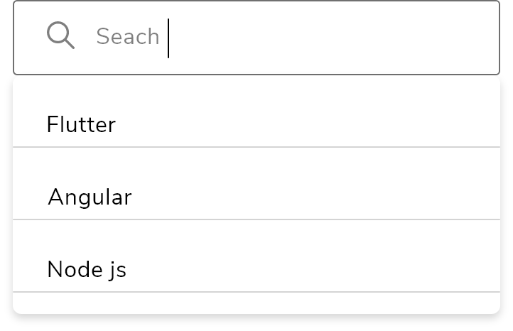

# GF SearchBar


GF SearchBar contains textfield for user input and the overlay container to show the search list collections.

### Usage

The simple code of a basic GFSearchBar is as shown below.

```dart
import 'package:getwidget/getwidget.dart';

List list = [
    "Flutter",
    "React",
    "Ionic",
    "Xamarin",
  ];

GFSearchBar(
  searchList: list,
  searchQueryBuilder: (query, list) {
    return list
        .where((item) =>
            item.toLowerCase().contains(query.toLowerCase()))
        .toList();
  },
  overlaySearchListItemBuilder: (item) {
    return Container(
      padding: const EdgeInsets.all(8),
      child: Text(
        item,
        style: const TextStyle(fontSize: 18),
      ),
    );
  },
  onItemSelected: (item) {
    setState(() {
      print('$item');
    });
  },
),
```

Look and feel of the **GFSearchBar** can be customized using the GFSearchBar properties.



### Custom Properties

| Name | Description |
| :--- | :--- |
| **searchList** | List of \[text\] or \[widget\] reference for users |
| **overlaySearchListItemBuilder** | defines how the \[searchList\] items look like in overlayContainer |
| **hideSearchBoxWhenItemSelected** | if true, it will hide the \[searchBox\] |
| **overlaySearchListHeight** | defines the height of \[searchList\] overlay container |
| **searchQueryBuilder** | can search and filter the \[searchList\] |
| **noItemsFoundWidget** | displays the \[widget\] when the search item failed |
| **onItemSelected** | defines what to do with onSelect \[SearchList\] item |
| **searchBoxInputDecoration** | defines the input decoration of \[searchBox\] |

