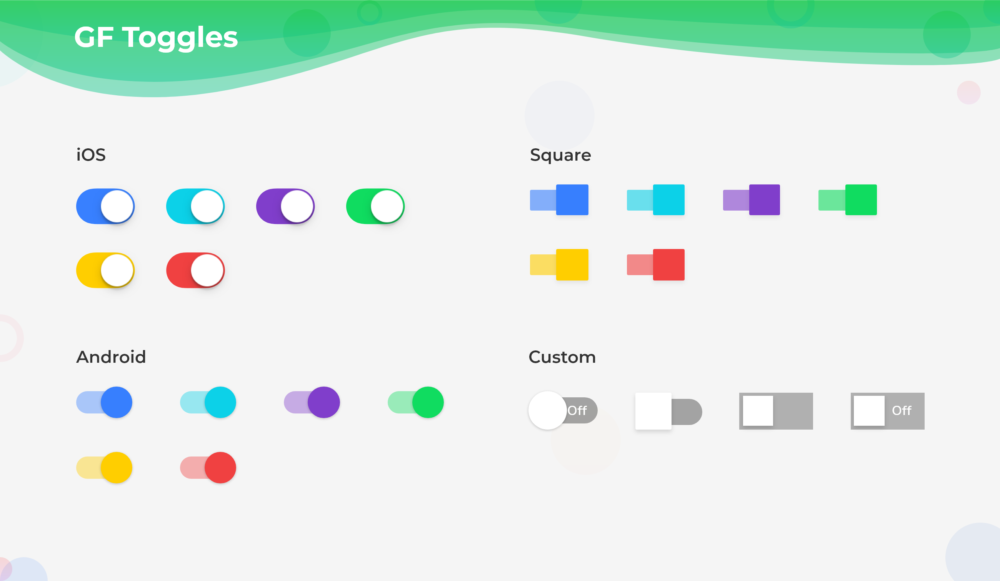

# GF Toggle



### Usage

The simple toggle code is as shown below.

```dart
import 'package:getwidget/getwidget.dart';

 GFToggle(
    onChanged: (val){},
    value: null,
 )
```

### Types of Toggle

There are four types ie, `android`, `ios`, `square` and `custom`. The default toggle is a android toggle

###  IOS Toggle


The below code shows a simple ios toggle

```dart
import 'package:getwidget/getwidget.dart';

 GFToggle(
    onChanged: (val){},
    value: null,
    type: GFToggleType.ios,
 )
```

### Square Toggle


The below code shows a simple square toggle

```dart
import 'package:getwidget/getwidget.dart';

 GFToggle(
    onChanged: (val){},
    value: null,
    type: GFToggleType.square,
 )
```

### Custom Toggle


The **custom** toggle can be used to add the text to the on/off state . The default text is **ON** and **OFF** Below is a simple code for custom toggle

```dart
import 'package:getwidget/getwidget.dart';

GFToggle(
   onChanged: null,
   value: null,
   type: GFToggleType.custom,
 ),
```

### Custom Properties

|  |  |
| :--- | :--- |
| **enabledText** | type of \[String\] used to add custom text i.e, ON, ENABLE |
| **disabledText** | type of \[String\] used to add custom text i.e, OFF, DISABLE |
| **enabledTextStyle** | type of \[TextStyle\] used to define the style properties of enabled text |
| **disabledTextStyle** | type of \[TextStyle\] used to define the style properties of disabled text |
| **enabledThumbColor** | color used for the active thumb color |
| **disabledThumnbColor** | color used for the disabled thumb color |
| **enabledTrackColor** | color used for the active track color |
| **disabledTrackColor** | color used for the disabled track color |
| **boxShape** | type of \[BoxShape\] ie , `circle`, `rectangle` used to change the shape of the thumb, default shape is `circle` |
| **borderRadius** | borderRadius should be given zero for a **ios** toggle to make it a **square** toggle with **boxshape** as `rectangle` |
| **duration** | animation duration called when the switch animates during the specific time elapse |

