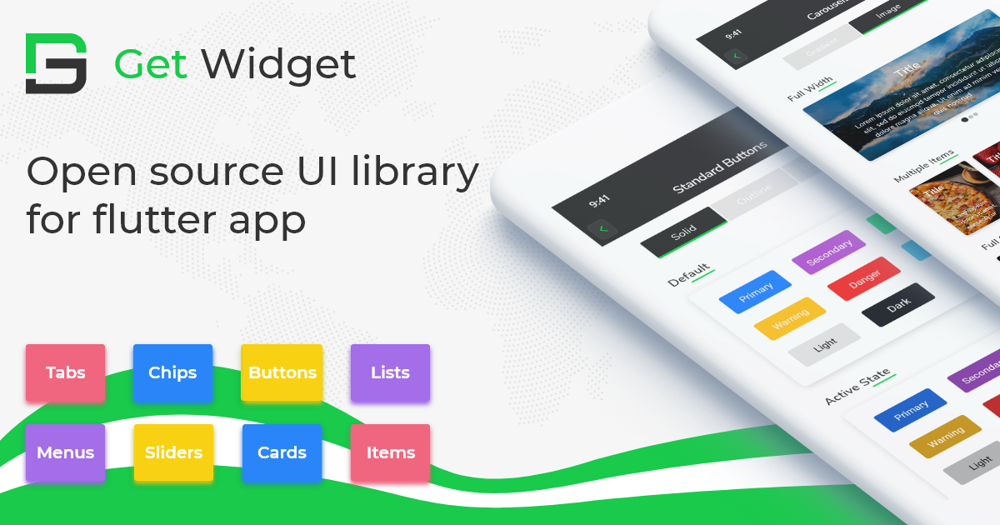

# Introduction

## How Get Widget Started?

We are a huge follower of Flutter and using it from very early stage even since it was released in alpha stage at 2017. We used it in various Flutter apps including  some of enterprise SAAS applications. 

Flutter almost has all the widget available that developer can use in project but again, we used to develop lots of project with flutter and hence decided why not we develop all the possible widget that can be reused in any project and speed up the app development. 

We launched or UI Library in the beginning  to develop, to test the library component. Kindly give us your feedback to improve and add more widgets to our library. 

## Get Widget Roadmap 

We are committed to continue this library development to make flutter app design & development less time consuming and with small learning curve too.

We will really appreciate if you could check our Roadmap and do Vote & share your Feedback on upcoming widgets and New features:   https://roadmap.getwidget.dev/

Your support and feedback helps us to build the best Flutter Open-Source product. 

### XD Link : [https://xd.adobe.com/view/f80280b8-82b9-4b40-68a3-5d26ff4c5c91-8e33/](https://xd.adobe.com/view/f80280b8-82b9-4b40-68a3-5d26ff4c5c91-8e33/) 

### [DOWNLOAD XD](https://drive.google.com/file/d/1vX7vT7soJS3weh7T8qWCTrmaA7_C-tDH/view?usp=sharing) 

